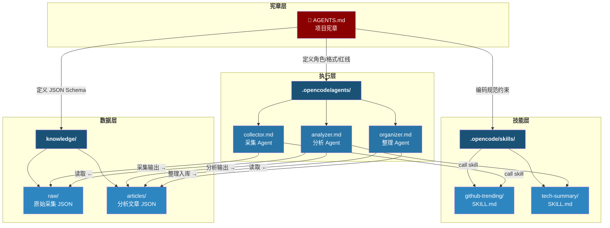

# AGENTS.md / Agents / Skills / knowledge 关系图

```mermaid
flowchart TB
    subgraph 宪章层["<b>宪章层</b>"]
        AG["📜 AGENTS.md<br/>项目宪章"]
    end

    subgraph 执行层["<b>执行层</b>"]
        direction LR
        AGENTS["<b>.opencode/agents/</b>"]
        A1["collector.md<br/>采集 Agent"]
        A2["analyzer.md<br/>分析 Agent"]
        A3["organizer.md<br/>整理 Agent"]
        AGENTS --> A1
        AGENTS --> A2
        AGENTS --> A3
    end

    subgraph 技能层["<b>技能层</b>"]
        SKILLS["<b>.opencode/skills/</b>"]
        S1["github-trending/<br/>SKILL.md"]
        S2["tech-summary/<br/>SKILL.md"]
        SKILLS --> S1
        SKILLS --> S2
    end

    subgraph 数据层["<b>数据层</b>"]
        KNOWLEDGE["<b>knowledge/</b>"]
        RAW["raw/<br/>原始采集 JSON"]
        ARTICLES["articles/<br/>分析文章 JSON"]
        KNOWLEDGE --> RAW
        KNOWLEDGE --> ARTICLES
    end

    AG -- "定义角色/格式/红线" --> AGENTS
    AG -- "定义 JSON Schema" --> KNOWLEDGE
    AG -- "编码规范约束" --> SKILLS

    A1 -- "call skill" --> S1
    A2 -- "call skill" --> S2
    A1 -- "采集输出 →" --> RAW
    A2 -- "读取 ←" --> RAW
    A2 -- "分析输出 →" --> ARTICLES
    A3 -- "读取 ←" --> ARTICLES
    A3 -- "整理入库 →" --> ARTICLES

    style AG fill:#8B0000,color:#fff
    style AGENTS fill:#1a5276,color:#fff
    style SKILLS fill:#1a5276,color:#fff
    style KNOWLEDGE fill:#1a5276,color:#fff
    style A1 fill:#2874a6,color:#fff
    style A2 fill:#2874a6,color:#fff
    style A3 fill:#2874a6,color:#fff
    style S1 fill:#2e86c1,color:#fff
    style S2 fill:#2e86c1,color:#fff
    style RAW fill:#2e86c1,color:#fff
    style ARTICLES fill:#2e86c1,color:#fff
```
